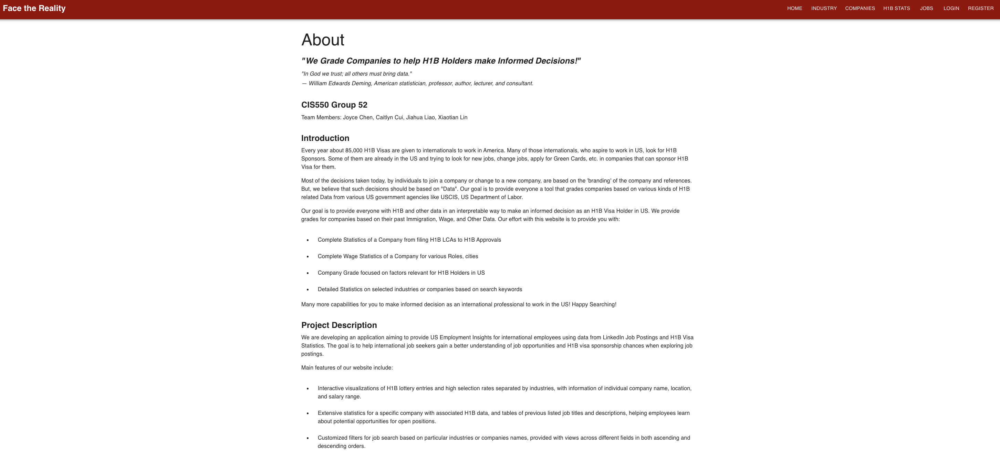

# Face the Reality

## Overview

**Face the Reality** is a full-stack web application that delivers data-driven employment insights for international job seekers, particularly those seeking H1B visa sponsorship in the United States. The application combines data from LinkedIn job postings and U.S. Department of Labor H1B visa records to help users make informed career decisions.

### 🔍 Key Features

- Visualize top industries by salary and company size
- View H1B sponsorship success rates and salary data by company
- Interactive job and company search interface
- Data insights tailored to international students and professionals

---

## Technologies Used

| Layer      | Stack                         |
|------------|-------------------------------|
| Frontend   | React.js, Chart.js, Bootstrap |
| Backend    | Node.js, Express.js           |
| Database   | PostgreSQL on AWS RDS         |
| Deployment | Local (with remote DB)        |
| Data       | LinkedIn, U.S. H1B LCA Data   |

---

## Running the Application Locally

### ✅ Prerequisites

- Node.js (v14+)
- Access to a running AWS RDS PostgreSQL instance
- Whitelisted IP in AWS RDS security group
- A `dev.js` file with your credentials at:  
  `server/config/dev.js`

---

### 1. Backend Setup (Node.js + Express)

```bash
cd server
rm -rf node_modules package-lock.json
npm install
npm start
```

This will start the backend API server at:  
`http://localhost:8080`

#### 🔐 Sample `server/config/dev.js`:

```js
module.exports = {
  secretOrKey: 'your_jwt_secret_here',
  dbConfig: {
    user: 'your_db_user',
    host: 'your-db-endpoint.region.rds.amazonaws.com',
    database: 'your_database_name',
    password: 'your_db_password',
    port: 5432,
    ssl: { rejectUnauthorized: false }
  }
};
```

> ⚠️ **Important**: Do not commit this file to GitHub. It contains sensitive information.

---

### 2. Frontend Setup (React)

```bash
cd client
rm -rf node_modules package-lock.json
npm install
npm start
```

The frontend will launch in your browser at:  
`http://localhost:3000`

---

## 📊 App Pages

| Page         | Description                                      |
|--------------|--------------------------------------------------|
| `/Industry`  | Top industries by salary and company size        |
| `/Company` | H1B sponsoring companies with statistics          |
| `/H1B Stats`      | Job search interface with sponsorship filters     |
| `/Job`     | H1B approval/denial rates and visualized metrics |

---

## 📁 Project Structure

```
550Proj/
├── client/           # React frontend
├── server/           # Express backend
│   └── config/
│       └── dev.js    # Your DB credentials (not committed)
├── README.md
```

---

## 🖼️ Application Screenshot

Here is a preview of the "About" page from the deployed web application:



---

## 👨‍💻 Contributors

Developed as a course project for CIS 5500 at the University of Pennsylvania:

- Joyce Chen  
- Caitlyn Cui  
- Jiahua Liao  
- Xiaotian Lin  